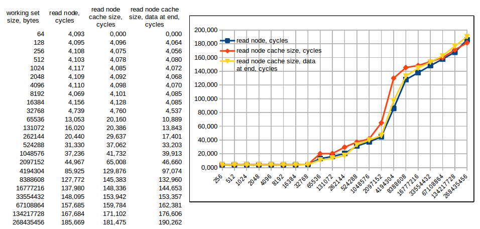
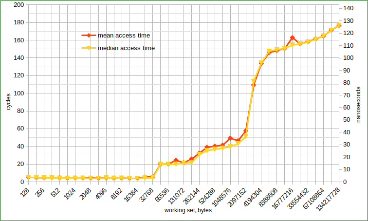
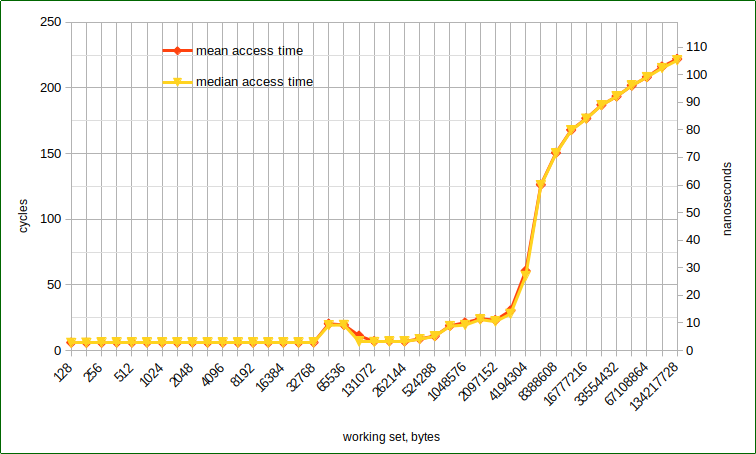
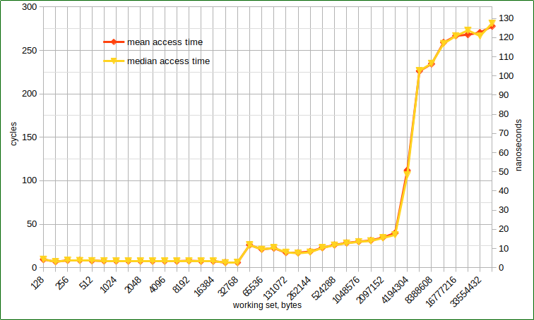

# cache_perf_test

What is this? It's a trivial memory access performance test for observing effects of a CPU cache.

## 2019

The goal of this test is to measure access time to randomly selected memory locations in some limited
range (working set) and to show that the access time depends on the working set size. It is caused by
CPU caches influencing which are dedicated to speed up access time for reasonably small working sets.
The caches are organized so the smallest one (named L1) is the fastest one. When the working set fits into
it the access time is smallest possible for this piece of hardware. For bigger working sets next cache
L2 joins the game. Then - L3. It's described in a good article [What Every Programmer Should Know About
Memory](https://people.freebsd.org/~lstewart/articles/cpumemory.pdf).

When I read the article for the first time in 2019, I had written the test and measured memory access
time in my Asus Zenbook having CPU Intel(R) Core(TM) i3-2367M and depicted numbers here:

## 2022
Slightly updated the testing code and get more clear result. Assuming that both experiments were run
at the same good old Intel(R) Core(TM) i3-2367M CPU @ 1.40GHz, I can see access time steps roughly
around CPU caches sizes. Let me remind you that the CPU has L1 - 64Kb, L2 - 256 Kb, L3 - 3Mb. The
graph shows results of running the test on one specific CPU core (cpuid=1). OS was isolated on
another cpuid=0 during the test.

What has been changed since that good old times? Recently I've bought mass market HP notebook with
AMD Ryzen 5 5500U and repeat the test on it. The CPU has L1 - 64Kb, L2 - 512Kb, L3 - 8Mb (from
https://www.techpowerup.com/cpu-specs/ryzen-5-5500u.c2372).  Strange, but official link
(https://www.amd.com/ru/products/apu/amd-ryzen-5-5500u#product-specs) says nothing about L1, stands
that L2 - 3Mb, and L3 - 8Mb. The graph shows results of running the test on a specific CPU core
(cpuid=1). OS wasn't isolated.

It looks like central memory access time became even worse than 10 years ago (please, don't blame
me that I compare different OEM manufacturers - Asus and HP, and different CPU manufacturers). But only
if we count CPU cycles, not real nanoseconds.

One more measured CPU, provided by my friend, is shown on the next graph. It's an Intel(R) Core(TM)
i3-8130U CPU @ 2.20GHz. It has L1 - 64Kb, L2 - 512Kb, L3 - 4Mb. To tell the truth, I don't see any
observable difference between L2 and L3 here. And again, caches stop working slightly earlier than
working set reachs corresponding size.

