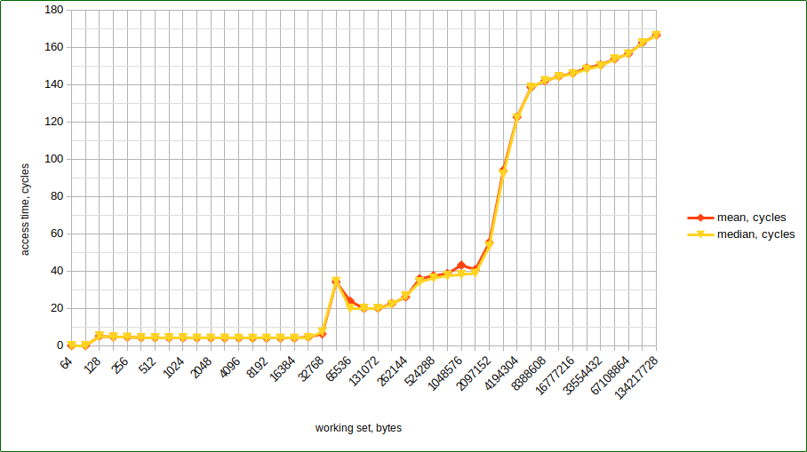

# cache_perf_test

## 2019
Trivial memory access performance test for observing CPU caches effects.

The goal of this test was to get flag steps on a memory access graph depending on
a working set size. Which is described in a good article [What Every Programmer
Should Know About Memory](https://people.freebsd.org/~lstewart/articles/cpumemory.pdf).

But the only result which I've could be able to reach is failing steps - here:

## 2022
Slightly updated the testing code and get more clear result. Assuming that both
experiments were run at the same good old Intel(R) Core(TM) i3-2367M CPU @ 1.40GHz,
I can see access time steps roughly around CPU caches sizes. Let me remind you that
the CPU has L1 - 64Kb, L2 - 256 Kb, L3 - 3Mb.

